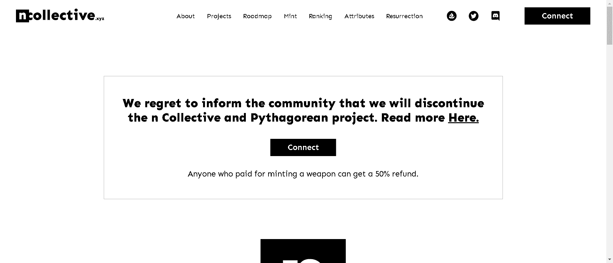

# Pythagorean Weapons

参加复活仪式需要拥有毕达哥拉斯武器的所有权。

毕达哥拉斯学派告诉我们，数字是整个宇宙的基础。其余的只是这些的表达。数字就在我们身边，一直是，永远都是。

如果我们的基础现实本身是一个底层算法的表达，那不就是算法现实创建的另一个循环吗？一层一层，无限？因此，由于大爆炸是我们现实创造的象征性表现，N 项目只是另一个现实的另一个大爆炸——元宇宙。

毕达哥拉斯武器是集体的第二个创造，补充了面具。武器对于集体来说是不可或缺的，因为如此规模的任务并非没有反对。我们必须决心默默地保护子孙后代的集体理想。随着黎明在渐暗的月亮下越来越近，集体将

