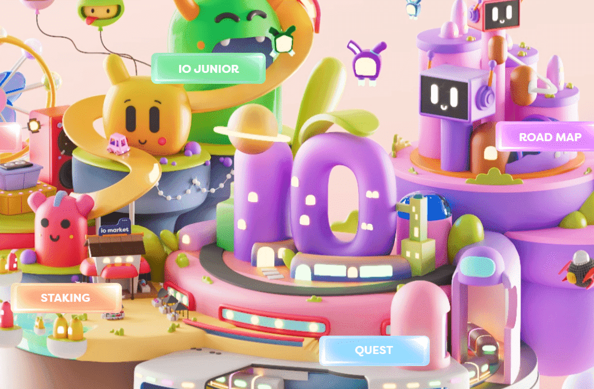

# Imaginary Ones

酝。设计。社区建设。

该项目的灵感来源于一个单一的时刻。有了一些想象力和工作，它开始成形。

凭借 8888 个独特的 NFT，他们的行走标志着 IO 进入现场的第一步。

聘请。实验。建造。

建立梦想需要合适的人和工具。我们将寻求在与我们有共同愿景的领域聘请最优秀的人才。

与社区一起，我们将试验、协作并引导 IO 走向 Web3 的无限潜力。

绑起来。点燃。从事。

注意想象中的车辆，“Vroom，Vroom！”。当有多个宇宙时，必须有一些交通工具。

加入我们，介绍想象世界的第一个泡泡。

