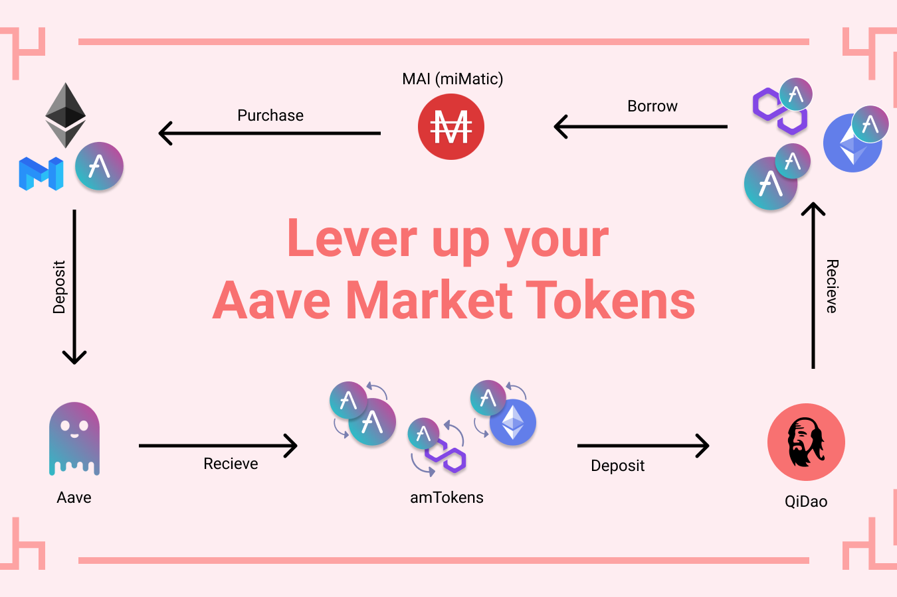

# QiDao

QiDao 是一种利用抵押债务头寸 (CDP) 的稳定币协议，允许用户以 0% 的利息铸造与美元挂钩的稳定币 MAI。QiDao 允许用户持有他们期望升值的资产，同时仍然能够将其用作抵押品。

可以在 QiDao 借入的较受欢迎的抵押品之一是 WBTC，因为价值数百万美元的 WBTC 已被用于铸造 MAI。WBTC 持有者已经能够通过 MAI 获取其代币的价值，以产生农场、杠杆化他们的头寸，甚至在现实生活中花费他们的马厩。

奇道在 5 个区块链中拥有 30 多种受支持的抵押品类型，用户可以使用这些抵押品来铸造 MAI。启道支持的许多抵押品类型都是计息的。

要开始以加密资产借贷，过程很简单：创建一个保险库，存入您的加密资产，然后开始以您的抵押品价值借入稳定币。您如何处理借入的资金取决于您自己。
