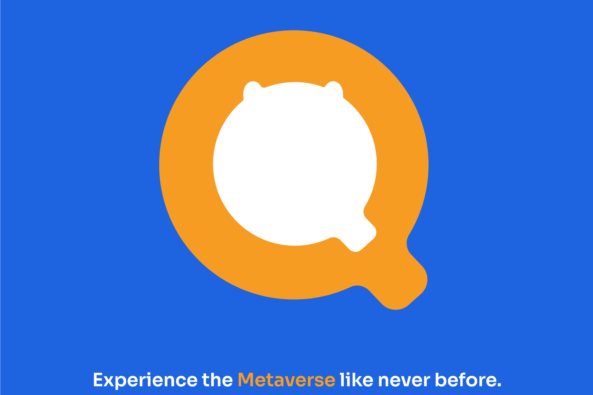

# QQS Metaverse

QQS 是一个社区驱动的计划，专注于 Web3 解决方案。它旨在为社区提供前所未有的 VR 体验，将用户聚集在一个身临其境且引人入胜的环境中。

其 Metaverse 计划 QQ World 将以购物区为特色，以吸引所有人群，为用户提供身临其境的发现驱动的品牌体验，并可以在全球范围内访问标志性商店。商家还可以 24/7 全天候打开他们的零售大门，让商店变得非常方便。

在 QQ 世界中，开发者和数字艺术家可以使用提供的简单 Builder 工具创作艺术品、挑战等，然后参加活动赢取奖品。对于更有经验的创作者，SDK（软件开发工具包）提供了构建高级社交游戏和应用程序的工具。

QQS 坚信，他们可以通过进入虚拟世界来克服当今最大的科技公司的陷阱，在那里他们可以为内容创建者、购物者、商家和用户提供一个可访问、公平和公平的平台。QQ世界将归用户所有，用户可以在其中创建和查看内容、相互社交、在线购物等等。QQS DAO 的所有参与者只要成为平台的一部分，就将在平台内拥有投票权和利益。
