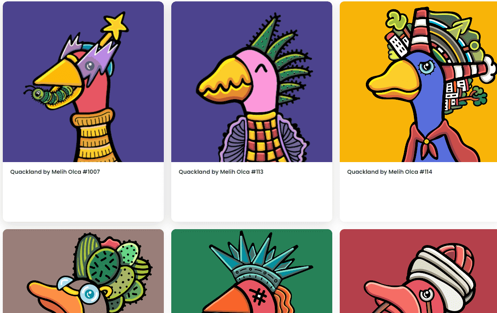

# Quackland by olcamelih

5,000 只专门设计和随机分配的鸭子等待被采用。前 1,000 个免费，以后每个 0,02 ETH。这个项目是由 olcamelih 想象和说明的。

olcamelih 的 Quackland 是什么？

olcamelih 的 Quackland 是一个 NFT（非同质代币）集合。存储在区块链上的数字艺术品集合。

Quackland by olcamelih 代币有多少？

olcamelih NFT 总共有 1,136 个 Quackland。目前，168 位车主的钱包中至少有一部 Quackland by olcamelih NTF。

olcamelih 最近卖出了多少台 Quackland？

过去 30 天内售出 0 个 Quakland by olcamelih NFT。

