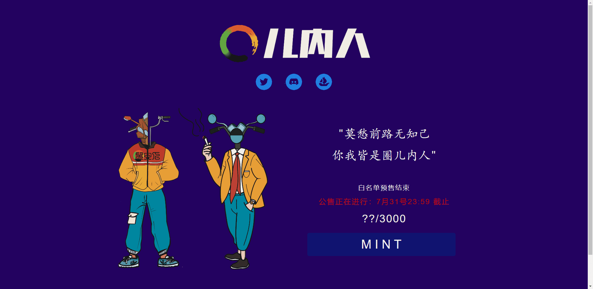

# QuanneirenNFT Official

进入圈内不可轻，时光不负有心人。莫愁前路无知己，天下谁人不识君。 圈儿内人NFT公售正在进行...... 

什么是全内人NFT官方？

QuaneirenNFT Official 是一个 NFT (Non-fungible token) 集合。存储在区块链上的数字艺术品集合。

QuaneirenNFT 官方代币有多少？

QuaneirenNFT 官方 NFT 总共有 1,762 个。目前 388 位所有者的钱包中至少有一个 QuaneirenNFT 官方 NTF。

最贵的全内人 NFT 官方特卖是什么？

最贵的 QuaneirenNFT Official NFT 是 QuaneirenNFT 。它于 2022 年 6 月 23 日（2 个月前）以 11 美元的价格售出。

最近卖出了多少全内人NFT Official？

过去 30 天内售出 276 个全内人 NFT 官方 NFT。

QuaneirenNFT 官方的费用是多少？

过去 30 天，全内人 NFT 官方 NFT 最便宜的销售额低于 5 美元，最高销售额超过 10 美元。QuaneirenNFT 官方 NFT 的中位价格在过去 30 天内为 7 美元。

