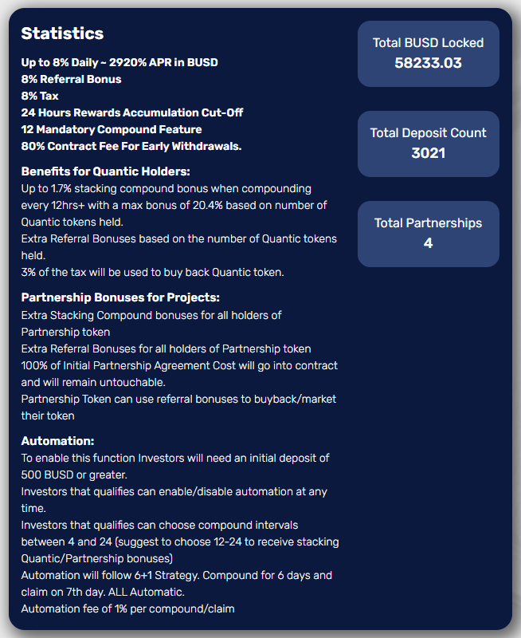

# Quantic Qube

**Qube 是一个建立在币安智能链网络上的去中心化 BUSD 矿工，旨在被动奖励稳定币 BUSD 的持有者。当您使用 dApp 存入 BUSD 时，您将收到：**

BUSD 每日高达 8% ~ 2920% 年利率

8% 推荐奖金

8% 税

24 小时奖励累积截止日期

12 强制复合特征

提前取款的 80% 合同费。

**Quantic Holder 的好处：**

每 12 小时+ 复利时，最高可叠加 1.7% 的复合红利，根据持有的 Quantic 代币数量，最高红利为 20.4%。

基于持有的 Quantic 代币数量的额外推荐奖金。

3% 的税收将用于回购 Quantic 代币。

**项目合作伙伴奖金：**

为所有合作伙伴代币持有者提供额外的 Stacking Compound 奖金

为所有合作伙伴代币持有者提供额外推荐奖金

初始合作协议成本的 100% 将进入合同并保持不变。

合作代币可以使用推荐奖金来回购/营销他们的代币

**自动化：**

投资者可以随时启用/禁用自动化

投资者可以选择4到24之间的复合区间（建议选择12-24来获得堆叠Quantic/Partnership红利）

自动化将遵循 6+1 战略。复利6天，第7天索赔。全部自动。

每个化合物/索赔 1% 的自动化费用
