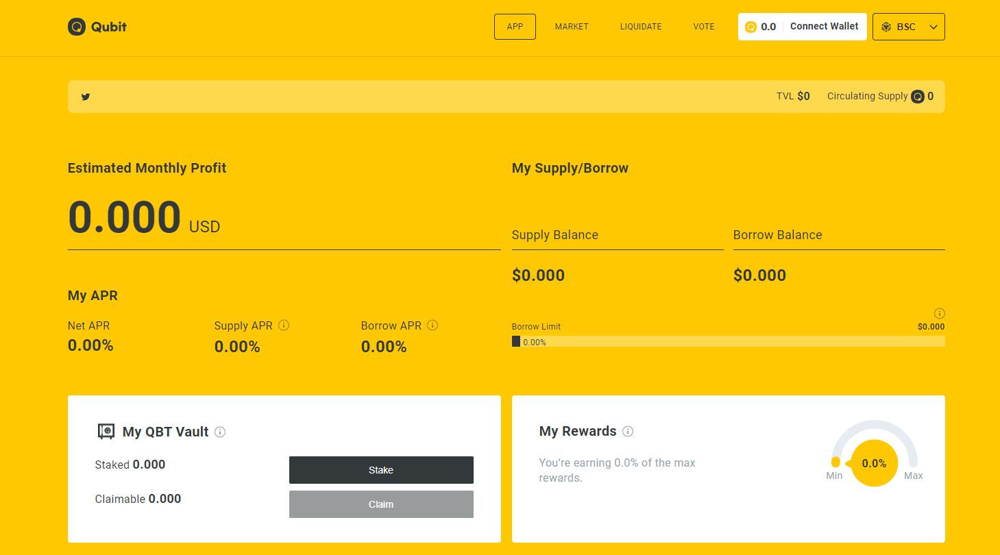

# Qubit Finance

Qubit 是一个去中心化的货币市场平台，它利用区块链的速度、自动化和安全性来高效、安全地连接借贷双方。

Qubit Finance 的用户可以作为贷方和借方参与。

**贷方**：作为流动性提供者，贷方可以存入资产借给他人。流动性提供者将从他们存入的资产中赚取利息。

**借款人**：借款人可以存入资产作为抵押品，并借入资产作为回报。

在 Qubit，我们致力于让货币市场成为整个 BSC 生态系统的安全商品。因此，Qubit 不收取阻碍更复杂杠杆策略在 BSC 上创新应用的提款费用。

Qubit 还明确致力于促进 BSC 的生态系统安全。Qubit 通过两种方式做到这一点。首先，Qubit 不支持闪贷，这从平台中消除了整个生态系统中最大的不安全来源之一。

其次，Qubit 团队将全面支持所有基于 Qubit 平台的白名单项目的垂直整合代码审查和全栈审计。这代表了 Qubit 一项重大但必要的生态系统投资，以消除由于去年 5 月中断和破坏许多项目的不协调迁移而注入 BSC 生态系统的漏洞。

最后，Qubit 是 Mound 为发展 PancakeBunny 生态系统而开发的不断增长的连接产品套件中的最新产品。作为收益聚合器，PancakeBunny 将利用 Qubit 的所有优势，为单一资产流动性提供链上最佳收益。
