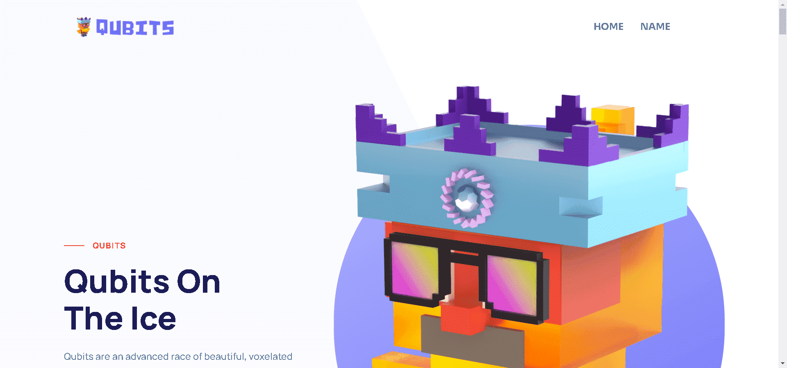

# Qubits On The Ice

量子位是生活在元宇宙中的体素字符。每个 Qubit 都以自己的方式独一无二，具有不同的体型、眼镜、耳朵、帽子、鞋子和纹身特征。它们装在一个超级闪亮的盒子里（盒子也有特点和稀有性）。然后，您作为所有者可以决定是否将您的 Qubit 拆箱（使用出色的 Dapp）或将其保留。

每个盒子对于其各自的 Qubit 来说都是独一无二的。更好的是，盒子是可定制的：您可以更改 Qubit 的名称，每个盒子都有自己的唯一编号。盒子还可以保护量子比特在交易时免受划伤和损坏。

