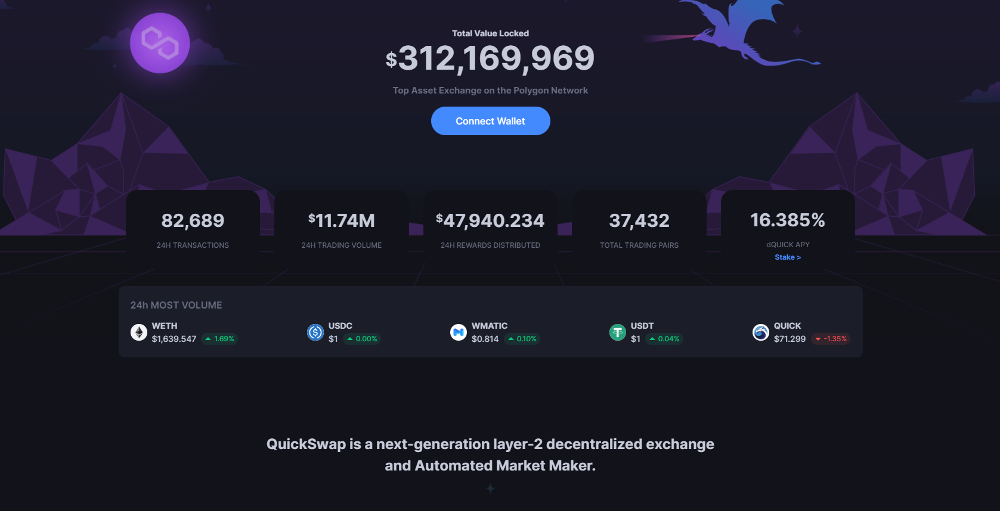

# QuickSwap

QuickSwap 是基于以太坊的无许可去中心化交易所 (DEX)，由 Matic Network 的第 2 层可扩展性基础设施提供支持。通过利用第 2 层进行交易，QuickSwap 用户将能够以**接近零的 gas 成本以闪电般的速度**交易任何 ERC20 资产。

#### 以接近零的汽油费交换代币

存入您的流动性提供者代币以在 LP 费用之外获得 $QUICK 奖励。

#### 通过存入您的 LP 代币获得额外奖励

存入您的流动性提供者代币以获得除 LP 费用之外的奖励。
