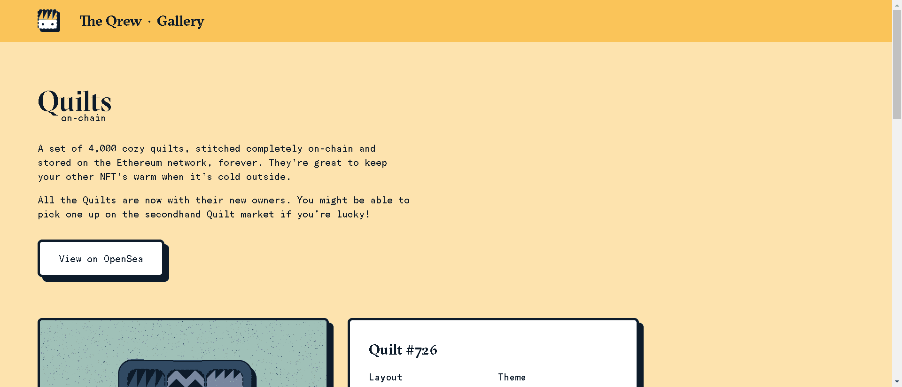

# Quilts on-chain

一套 4,000 张舒适的被子，完全在链上缝合并永久存储在以太坊网络上。当外面很冷时，它们非常适合让您的其他 NFT 保持温暖。

所有的被子现在都和他们的新主人在一起了。如果幸运的话，您也许可以在二手被子市场上买到一件！

每个被子都是 ERC-721 NFT。它们包含生成的 SVG 图稿，以及用于生成它们的元数据。然后将此数据编码并存储在以太坊区块链上。这意味着没有 IPFS 链接，也没有元数据服务器。只要以太坊区块链存在，每个铸造的被子就会存在，这真是太神奇了！

