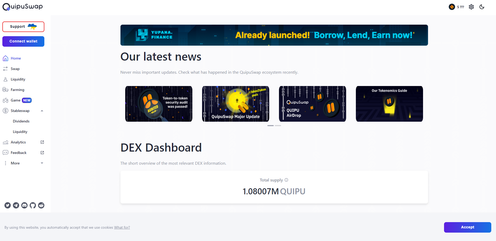

# QuipuSwap

QuipuSwap 是一个开源协议，为基于 Tezos 的代币和 XTZ 的无缝去中心化交换提供接口。利用 Tezos 协议的优势，例如流动性 XTZ 委托，流动性提供者可以从交换费和面包师奖励中获得收益。 

## QuipuSwap 机会

开始与 Tezos 上最大的 DEX 合作：交换、农场、股权。

**交易任何基于 Tezos 的代币**

立即在 QuipuSwap DEX 上交换任何 FA1.2-FA2 代币。我们有超过 150 个交易对可用且费用低廉。

**使用 QuipuSwap 的农场代币**

您可以通过参与我们的农场项目获得额外奖励。向池中添加流动性，在我们的农场中质押您的流动性代币，并获得奖励。

**通过提供流动性赚钱**

通过将您的代币添加到流动性池中，您将获得该池中每个交易操作收取的 0.3% 费用的一部分以及烘焙奖励。
