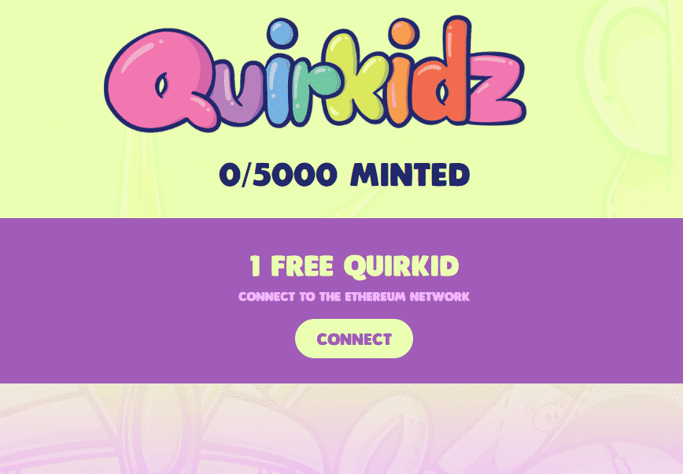

# Quirkidz & Co.

什么是 Quirkidz & Co.？
Quirkidz & Co. 是一个 NFT（非同质代币）集合。存储在区块链上的数字艺术品集合。
有多少 Quirkidz & Co. 代币？
总共有 5,000 个 Quirkidz & Co. NFT。目前，1,218 位车主的钱包中至少有一个 Quirkidz & Co. NTF。
Quirkidz & Co. 最昂贵的销售是什么？
最昂贵的 Quirkidz & Co. NFT 是 Quirkid #527。它于 2022-06-06（3 个月前）以 45.3 美元的价格售出。
最近卖出了多少 Quirkidz & Co.？
过去 30 天内售出了 5 个 Quirkidz & Co. NFT。
什么是流行的 Quirkidz & Co. 替代品？
许多拥有 Quirkidz & Co. NFT 的用户还拥有 Wizard Treasure Collective、 Okay Panda、 SlimezNFT和 Baby Reptilian Renegade Lizards 。

