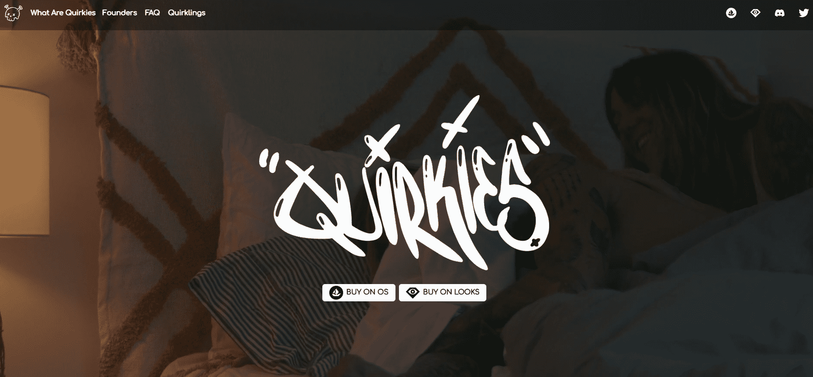
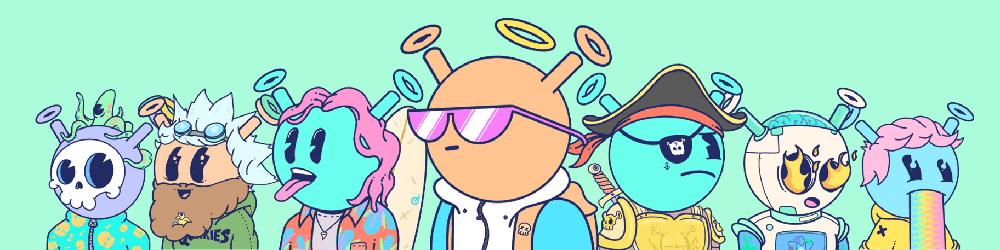

# Quirkies Originals

Quirkies 是在以太坊区块链上铸造的 5,000 个独特字符的集合。Quirkie 是您的私人伴侣，将成为您的元宇宙角色，因此请确保您拥有一个您认为代表您的 Quirkie。古怪是由我们的团队艺术家通过数百个古怪特征创造的。

Quirksville 一直在扩大，随着我们品牌的发展，Quirksville 持有者可以期待获得最新产品、商品和活动的特殊访问权。

**知识产权**

Quirkie 的所有者拥有艺术 IP。只要他们拥有那个特定的 Quirkie，他们就可以随意使用图像。以盈利为目的使用该图像必须在销售后停止。尽管持有人拥有 IP，但他们不拥有任何 Quirkies 徽标或其他使用的艺术作品，因此未经书面批准不得使用。

**稀有度**

我们故意没有在任何稀有网站上正式列出，因为我们认为社区应该将 Quirkie 的价值建立在其艺术而非稀有性之上。我们已经看到了这种情况的发生，社区对一些更常见的特征的评价更高，因为它们的整体合意性更高。这使艺术品保持在收藏的最前沿，而不是稀有分数。
