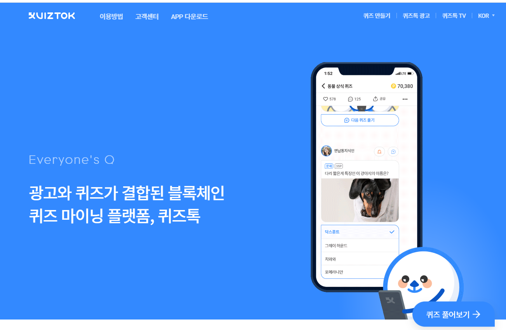

# Quiztok

在 Quiztok 平台中，测验内容带有广告。用户可以通过解决测验和消费广告同时获得奖励积分。从 Quiztok 获得的奖励积分可以转换为代币，用户可以通过多种不同的方式使用它们。例如，Quiztok 用户可以成为广告商并使用代币支付广告费用。用户还可以以自己的名义捐赠宽度代币或用现金兑换代币。使用过的 QTCON 将被广告商再次购买，并用于广告商在 Quiztok 平台上的广告费用。Quiztok 使用的区块链技术对于广告商来说是高度可靠和有效的，可以通过其透明和安全的系统来展示他们的广告。随着用户解决更多的测验，广告消费将增加。这将导致 Quiztok 平台中的广告效果增加。
