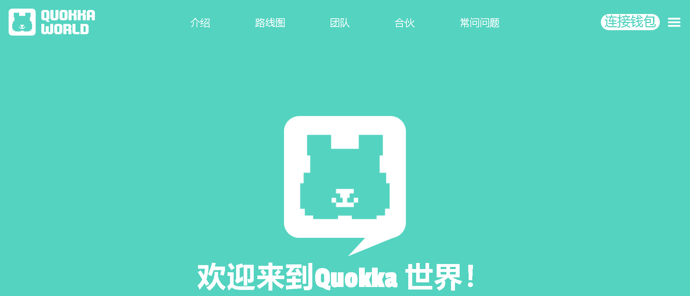

# QUOKKA WORLD | Anyquokka

Quokka World 是一个使用人工智能的 NFT 项目。
用人工智能找到你喜欢的概念的短尾矮袋鼠。

▶ 什么是短尾矮袋鼠，短尾矮袋鼠！？
库卡，库卡！是一个 NFT（不可替代代币）集合。存储在区块链上的数字艺术品集合。

▶ 多少 Quokka，Cuokka！代币存在吗？
总共有 121 只短尾矮袋鼠，库柯卡！NFT。目前 2 位业主至少拥有一只 Quokka，Cuokka！NTF 在他们的钱包里。

