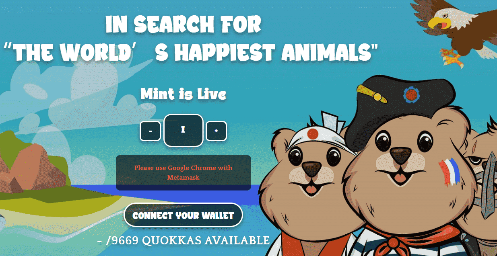

# QuokkaEmpire

Quokka Empire 是 9,669 只具有不同特征的可爱短尾矮袋鼠的集合，最初的价格仅为 0.069 ETH。

它们是隐藏在以太坊区块链中的独特 NFT。目标是找到它们，将雌性和雄性结合起来，帮助短尾矮袋鼠繁殖。所有 Quokka 都作为 ERC-721 代币存储在以太坊区块链上，并托管在 IPFS 上。 

当您购买 Quokka 时，您不仅仅是在区块链上购买了一件珍贵的稀有艺术品。您将获得进入 Quokka 爱好者私人俱乐部的会员资格，在那里您会发现志同道合的人随时欢迎您。加入我们以获得前所未有的奖励和冒险。

每个人都应该拥有一只短尾矮袋鼠——它们很有趣、很开朗，而且笑容可掬。它们被归类为易危物种，隐藏在世界各地。与我们一起进入短尾矮袋鼠模式，完成这个充满惊人奖励和短尾矮袋鼠自拍的有趣任务。

