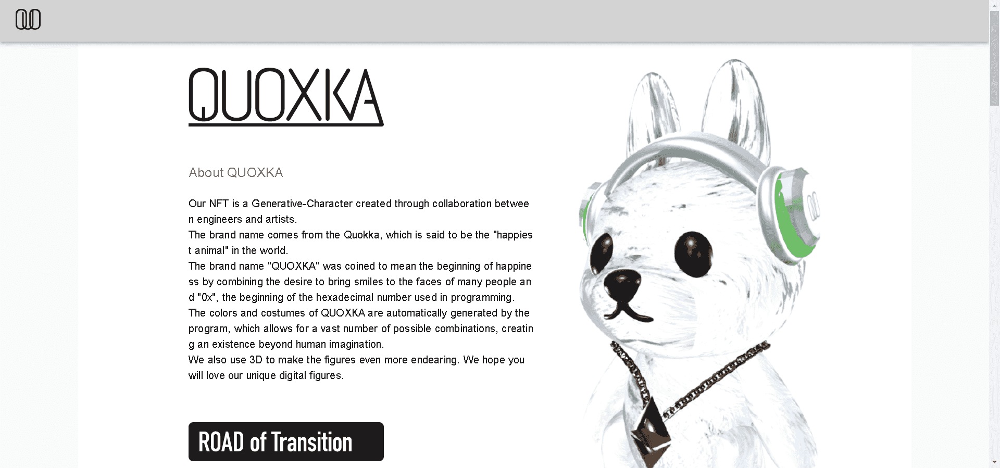

# QUOXKA Generative-Figure

我们的 NFT 是通过工程师和艺术家之间的合作创建的 Generative-Character。

品牌名称来源于短尾袋鼠，据说它是世界上“最快乐的动物”。

品牌名称“QUOXKA”是通过结合为许多人的脸上带来微笑的愿望和编程中使用的十六进制数字的开头“0x”而创造的，意味着幸福的开始。

QUOXKA的颜色和服装由程序自动生成，允许大量可能的组合，创造出超乎人类想象的存在。

我们还使用 3D 使人物更加可爱。

