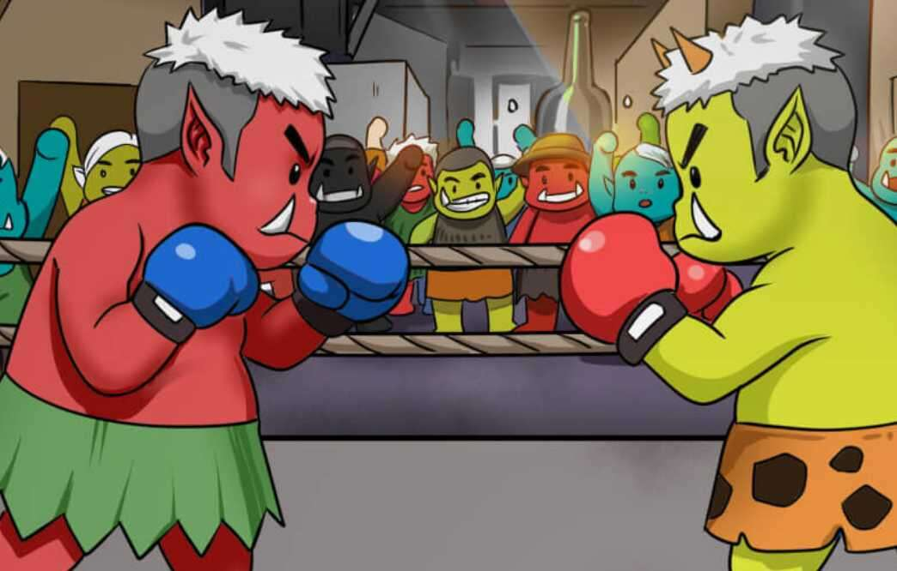

# R0N1 World

1,000 个神秘的微型怪物的完全生成集合。由衍生艺术家 CryptoDilly 创建，具有超过 75 个手绘特征。这些可爱而活泼的生物一直生活在 Ethereal Enclave 之下。发誓保护他们的大朋友，同时以自己的方式登上顶峰。

R0N1 是众所周知的好战的野兽，喜欢战斗、进食和繁殖。

当我们踏上下一个目的地时，加入我们的旅程。

R 0 N 1 是众所周知的好战的野兽，喜欢战斗、进食和繁殖。

要申请经过验证的角色，您必须持有 R0N1，只需转到#holder-verification

R0N1 源自 @IMCMPL 绘制的 0N1 Force 系列中的 Oni Doll 特征。这组艺术品由知名的 NFT 衍生艺术家和创作者 CryptoDilly 创作。

这是一个社区主导的项目，不是官方的 0N1 Force 项目，但得到了团队的支持。

