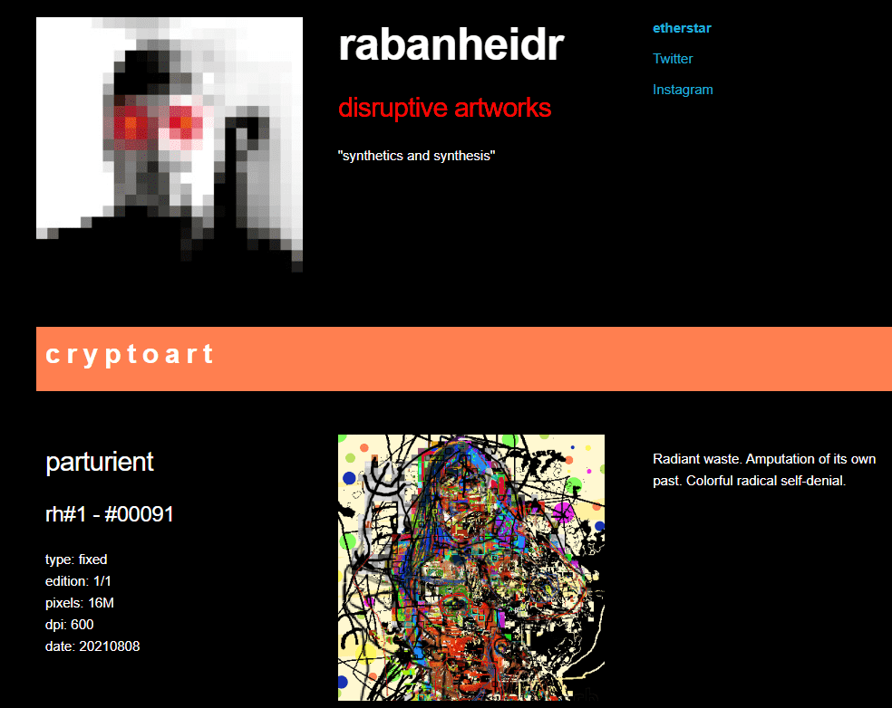

# rabanheidr

什么是拉班海德？

rabanheidr 是一个 NFT（非同质代币）集合。存储在区块链上的数字艺术品集合。

存在多少个 rabanheidr 代币？

总共有 92 个 rabanheidr NFT。目前，29 位所有者的钱包中至少有一个 rabanheidr NTF。

最近卖出了多少个 rabanheidr？

过去 30 天内售出 0 个 rabanheidr NFT。

现在没有什么比#Bitcoin更需要的了。而且大部分已经涵盖：水、食物、火、武器、药品、衣服、易货货物。派对可以开始了。

为了在未来赌上你的主张，投资于过去。历史上的 NFT 是去中心化元宇宙状态的文化基础，将持续一千年。仍然很少有人了解真正数字所有权的全部含义。

