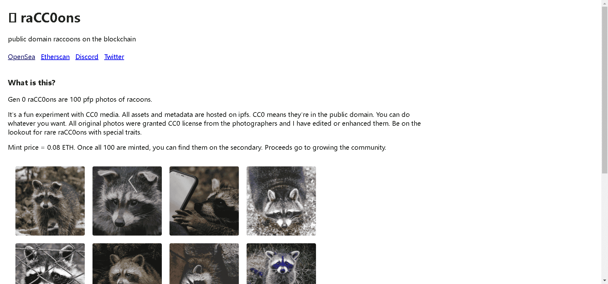

# raCC0ons

raCC0ons 是区块链上的公共领域浣熊。

Gen 0 raCC0ons 是 100 pfp 的浣熊照片。所有照片均获得摄影师的 CC0 许可。

不保留任何权利。做任何你想做的事。留意具有特殊性状的浣熊。;)

这是一个有趣的 CC0 媒体实验。所有资产和元数据都托管在 ipfs 上。CC0 表示它们在公共领域。你想做什么，就可以做什么。所有原始照片均已获得摄影师的 CC0 许可，我已对其进行了编辑或增强。留意具有特殊特征的稀有浣熊。

