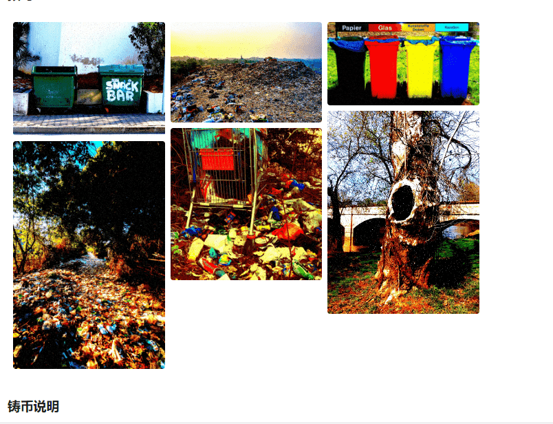

# raCC0ondenzas by wiznav

raCC0ondenzas 是区块链上美味的油炸浣熊巢穴和栖息地 (DENZAS)。

不保留任何权利。

创建（只是为了好玩）因为我喜欢 raCC0ons。

铸造 raCC0ndenzas 的唯一方法是通过智能合约。以下是如何做到这一点：

在 EtherScan 上访问合约

在合约选项卡中，点击“Write Contract”，然后点击“Connect to Web3”并连接你的钱包

展开功能#2。在payableAmount字段中输入0.08，然后点击“Write”

确认您钱包中的交易，NFT 将被铸造到您的钱包中

警告：如果它要你支付 TON 的 gas，这意味着它已经售罄（或者你没有在应付字段中输入 0.08）

所有资产和元数据都托管在 ipfs 上。CC0 表示它们在公共领域。所有原始照片均已获得摄影师的 CC0 许可，我已对其进行了编辑或增强。

