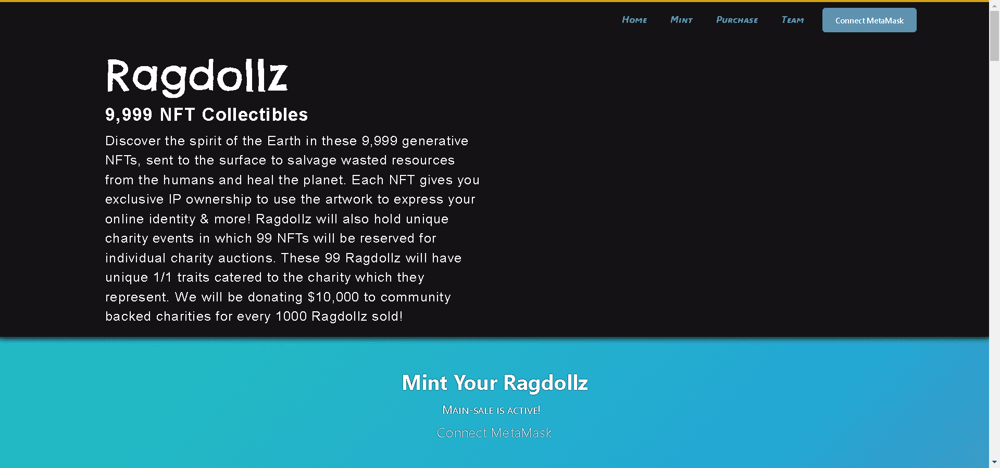

# Ragdollz NFTS

在这 9,999 个生成的 NFT 中发现地球的精神，这些 NFT 被送到地表以挽救人类浪费的资源并治愈地球。每个 NFT 都为您提供独家 IP 所有权，以使用艺术品来表达您的在线身份等等！Ragdollz 还将举办独特的慈善活动，其中将保留 99 个 NFT 用于个人慈善拍卖。这 99 个 Ragdollz 将具有独特的 1/1 特征，以迎合他们所代表的慈善机构。每售出 1000 个布娃娃，我们将向社区支持的慈善机构捐赠 10,000 美元！

