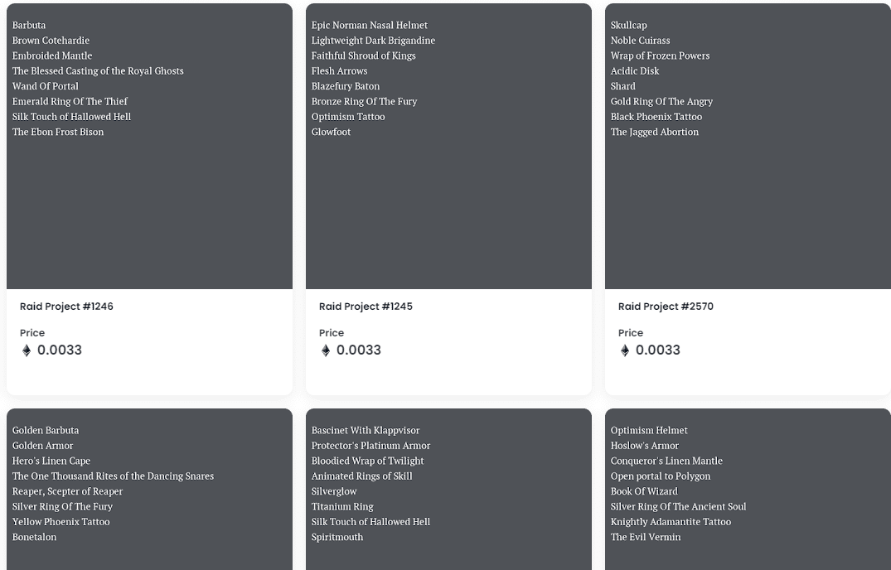

# Raid Project (For Adventurer)

我们和我们的团队在很长一段时间内都在默默地讨论这个项目的发展方向。新事物正在酝酿之中，我们很高兴地宣布这一消息。

为什么大家都这么恐慌。我们昨天推出。这是一个一日项目。更多的合作伙伴关系和公关即将到来。卖家会rekt。谢谢你的耐心。

让我们参加模因比赛@raidproject1. 获得此 Raiders Top 5 的获胜模因将在他们选择的链上各获得 10 个$STG代币

什么是突袭项目？

Raid Project 是一个 NFT（Non-fungible token）集合。存储在区块链上的数字艺术品集合。

存在多少 Raid Project 代币？

总共有 2,656 个 Raid Project NFT。目前，859 位所有者的钱包中至少有一个 Raid Project NTF。

最近卖出了多少 Raid Project？

过去 30 天内售出 0 个 Raid Project NFT。

