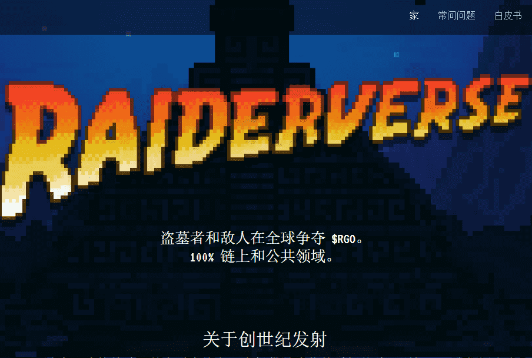

# Raiderverse Genesis

Genesis NFT 是 Raiderverse 游戏玩法的基础，并在以太坊主网上提供游戏化的质押体验（别担心，我们还会有一个 Polygon 桥）。

Genesis 系列由 10k 古墓丽影角色组成。它们都具有独特的伪随机 DNA，并且 100% 在以太坊区块链上生成和编码为 ERC721 代币。他们开始了对 RaiderGold 的危险追捕。

押注你的袭击者来寻找 RaiderGold ($RGO)。$RGO 是一种 ERC20 代币，最初可用于购买武器。在 DEX 上公开上市后，Raiderverse 内部和外部将会有更多的未来实用程序。

您可以使用 $RGO 购买得分更高的武器，以添加到您的代币军械库中，这将通过更强大的武器增加您的赌注奖励乘数。购买的武器可以在 NFT 图像和元数据中设置为 active_weapon。

