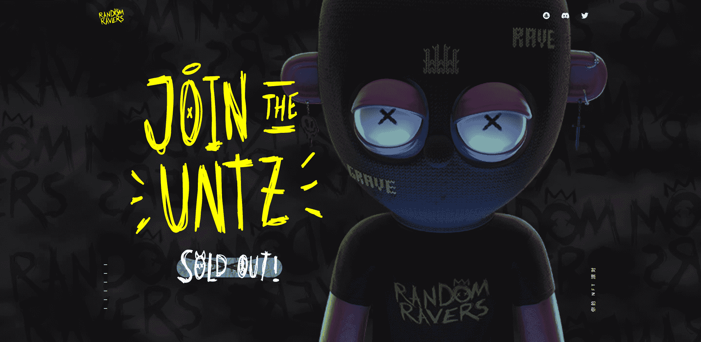

# Random Ravers

这是一个流行文化故事，讲述了一个男人沉迷于他最喜欢的甜甜圈并与他们过着共同生活的故事。他试图像往常一样过自己的生活，用各种巧妙的方法不让甜甜圈伤害他，因为它们已经与他的身体密不可分。但是......通常情况下，甜甜圈会挡道，事情会出错。

什么是可穿戴甜甜圈？

Wearable DONUTS 是一个 NFT（不可替代代币）系列。存储在区块链上的数字艺术品集合。

有多少个 Wearable DONUTS 代币？

总共有 184 个可穿戴 DONUTS NFT。目前，182 位所有者的钱包中至少有一个 Wearable DONUTS NTF。

最昂贵的可穿戴甜甜圈销售是什么？

最昂贵的 Wearable DONUTS NFT 是 Daily life in donuts Sauna-chan ver。. 它于 2022-08-07（25 天前）以 112.6 美元的价格售出。

最近卖出了多少 Wearable DONUTS？

过去 30 天内售出了 1 个可穿戴 DONUTS NFT。

