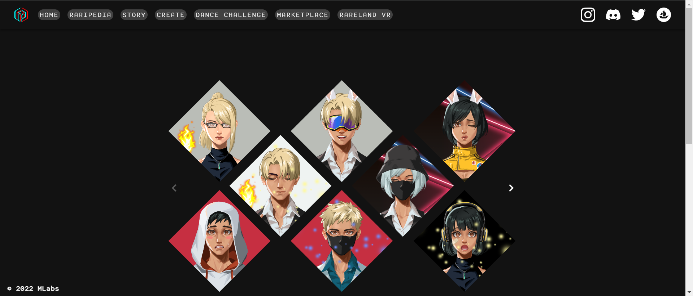

# Rare Land NFT

NFT 不应该只是 JPEG。获得一份 Rare Land NFT 并加入我们在 Rare Land 中跳舞！

Rare Land NFT 是用 100 多首歌曲解锁我们的音乐游戏并与朋友战斗的门户，10,000 个 Rare Land NFT 的集合将成长为化身，并为您提供 Rare Land 上许多稀有地方的会员访问权限。

总部位于加利福尼亚州硅谷，是一支来自 Google、Meta、Oculus、Ubisoft 和 Weta 的团队，拥有 10 多年的经验。目标是让游戏和 VR 去中心化和开放，由社区拥有和创造。

