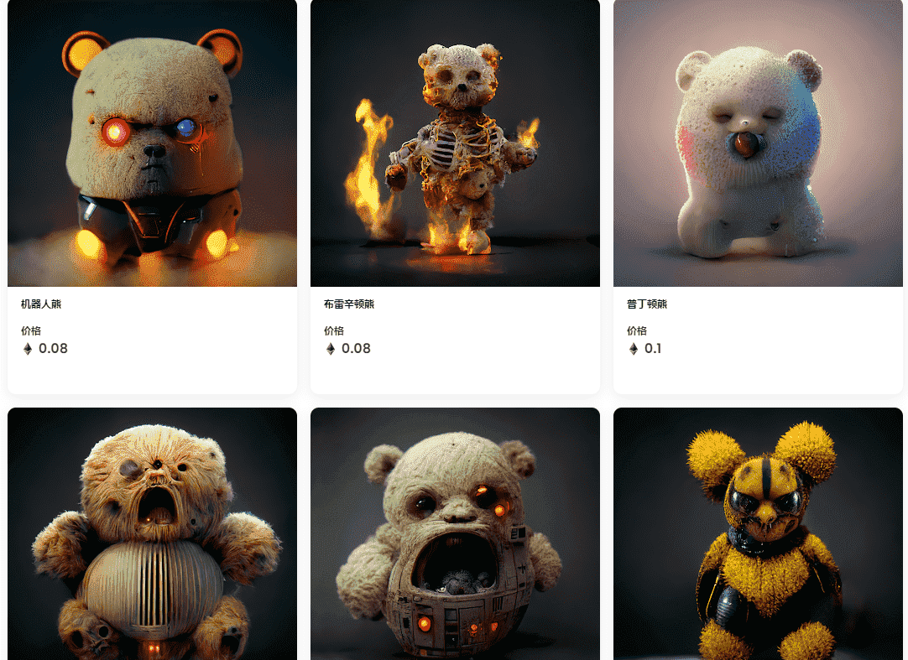

# Rare 'Mare Bears

由@kerb 与 Midjourney AI beta 创建的一组独特的令人不安的泰迪熊

什么是稀有的母马？

Rare 'Mare Bears 是一个 NFT（不可替代代币）系列。存储在区块链上的数字艺术品集合。

有多少 Rare 'Mare Bears 代币？

总共有 98 个 Rare 'Mare Bears NFT。目前，18 位所有者的钱包中至少有一只 Rare 'Mare Bears NTF。

最昂贵的 Rare 'Mare Bears 拍卖会是什么？

出售的最昂贵的 Rare 'Mare Bears NFT 是 Teddygorgon。它于 2022-06-10（3 个月前）以 138.2 美元的价格售出。

最近卖出了几只 Rare 'Mare Bears？

过去 30 天内售出了 4 个 Rare 'Mare Bears NFT。

