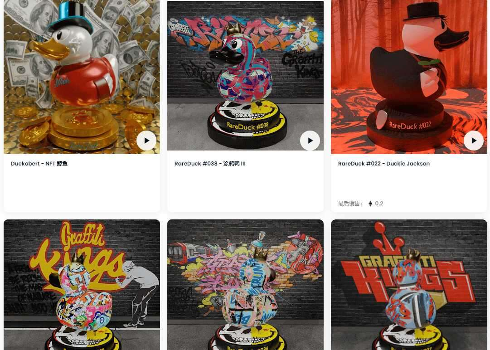

# RareDucks V2

RareDucks 是有限的收藏品，有不同的颜色、纹理、材料、服装或您能想象的任何东西。

每周都有新的小鸭子在这里蹒跚而行。

什么是 RareDucks V2？

RareDucks V2 是一个 NFT（Non-fungible token）集合。存储在区块链上的数字艺术品集合。

有多少 RareDucks V2 代币？

总共有 14 个 RareDucks V2 NFT。目前，35 位所有者的钱包中至少有一个 RareDucks V2 NTF。

最近卖出了多少 RareDucks V2？

过去 30 天内售出 0 个 RareDucks V2 NFT。

