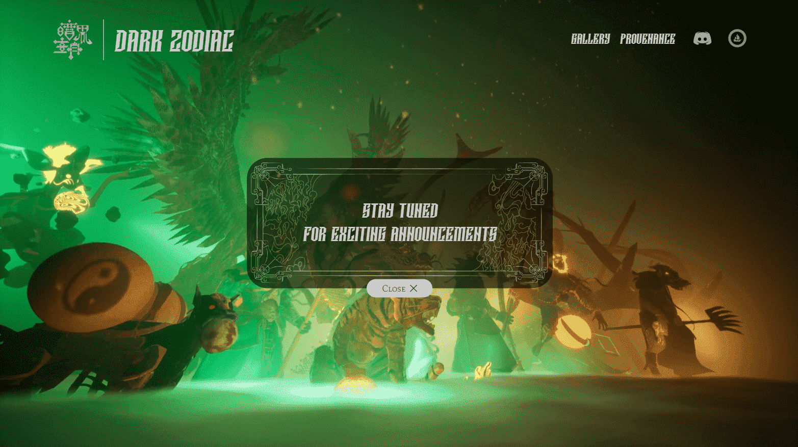

# Rari Zodiac Animals

Dark Zodiac 是一个受十二生肖民间传说启发的非生成 NFT 收藏项目。在系列 1 中，有限供应 3,876 个 NFT，在以太坊区块链上永生。

每个 Dark Zodiac NFT 都经过内部精心开发和制作，成为精美而复杂的 3D 数字艺术品。

玉皇大帝称地球为种族。奖励？作为十二天卫之一的永恒荣耀，被召唤来守护玉皇大帝的宝藏，并被所有人不朽，以标记和衡量时间的流逝。

这些动物，每个人都有自己的能力、智慧和计划，将在比赛中不惜一切代价证明自己的价值并在神殿中占据一席之地。所有人都不知道，这个种族与我们所知道的天真纯洁的民间传说相去甚远。没有什么是太具有欺骗性、血腥或道德偏差的了。这才是真正的十二生肖。

