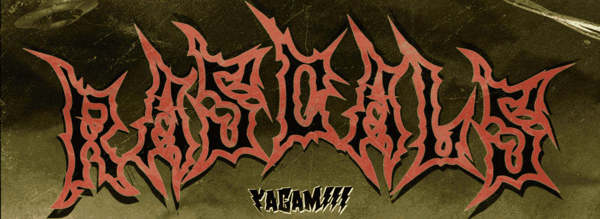

# RASCALS GENESIS

“流氓”创世纪系列由 Yagamiii 创作的 111 个 3D 雕刻角色组成。

每个 Rascal 都是在 iPad 上精心雕刻和建模的。一个以艺术为中心的社区互动项目，灵感来自电影、艺术、动漫、音乐、视频游戏等文化。

▶ 什么是 RASCALS GENESIS？
RASCALS GENESIS 是一个 NFT（非同质代币）集合。存储在区块链上的数字艺术品集合。

▶ 存在多少个 RASCALS GENESIS 代币？
总共有 48 个 RASCALS GENESIS NFT。目前，14 位所有者的钱包中至少有一个 RASCALS GENESIS NTF。

