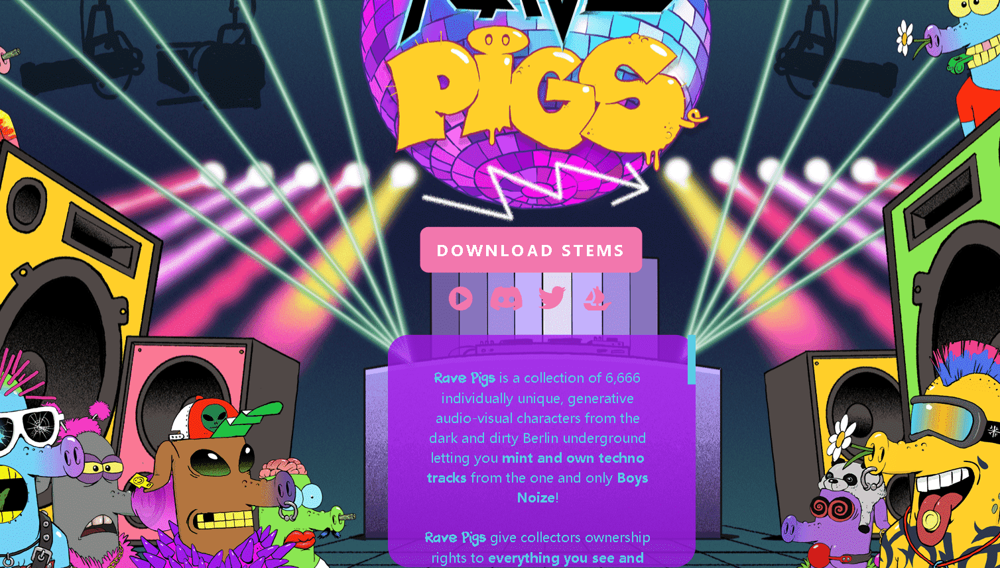

# Rave Pigs

Rave Pigs 是 6,666 个独特的、生成的视听角色的集合，这些角色来自黑暗肮脏的柏林地下，让您从唯一的 Boys Noize 创作和拥有 techno 曲目！

Rave Pigs赋予收藏家对所见所闻的所有权。每个Rave Pig角色都是通过 129 个特征组合而成的，这些特征分布在 10 个视觉类别和 5 个音频层中，有超过50 万亿种可能的组合。

Rave Pigs作为ERC-1155令牌存储在以太坊区块链上，可以以.png和.mp4格式下载。

