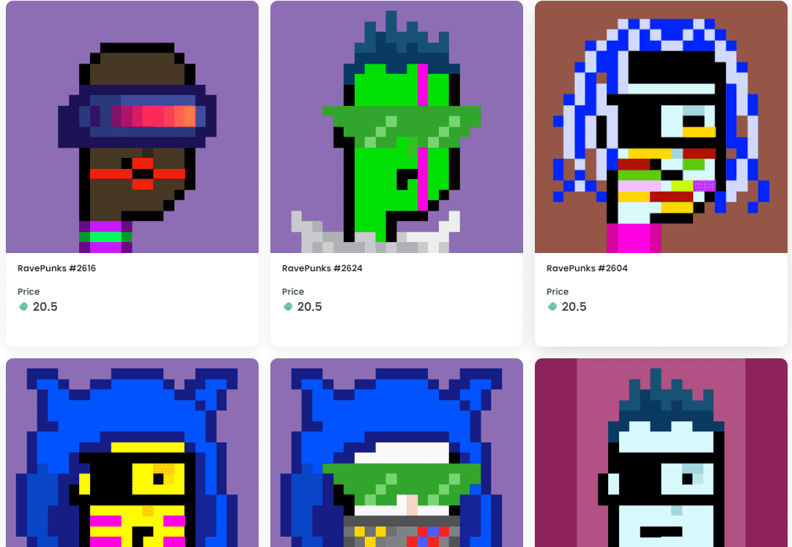

# RavePunks

该集合创建于 2021 年 4 月 21 日。

150 个独特的 (1/1) RavePunks + 一些协作插槽（现在：3 个），可将其他艺术家带到派对！

120 舞池（蓝色）  15 VIP（深蓝色）  10 后台贵宾（黄色） 5 特邀嘉宾（橙色）

不隶属于 Larvalabs

什么是 Rave Punks？

Rave Punks 是一个 NFT（不可替代令牌）集合。存储在区块链上的数字艺术品集合。

存在多少 Rave Punks 代币？

总共有 153 个 Rave Punks NFT。目前，57 位所有者的钱包中至少有一个 Rave Punks NTF。

最近卖出了多少 Rave Punk？

过去 30 天内共售出 0 个 Rave Punks NFT。

