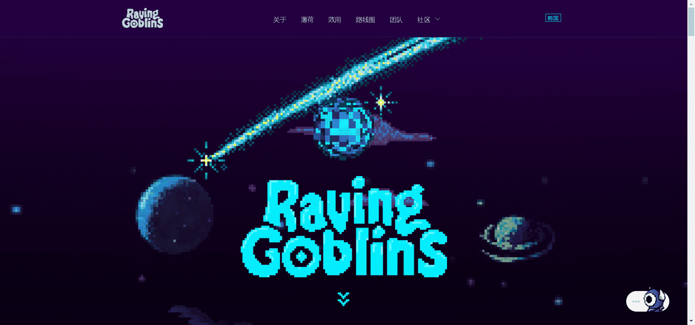

# Raving Goblins V2

来自音乐星球的 10,000 多个独特的妖精在我们空间的尽头！狂暴的哥布林来自 Musica，一个隐藏在几光年之外的小行星。他们看似混乱的世界依靠由音乐、舞蹈和艺术推动的宇宙能量运行。为了创造能量，他们必须 24/7 参加派对，使他们成为已知和未知星系中最大的派对爱好者。

Raving Goblins 是最酷、最病态的星际舞者，总是想狂欢。现在，他们正在将他们的狂欢带到地球。你准备好参加派对了吗？只有 10,456 名独特的 Raving Goblins 将参加第一次狂欢。

