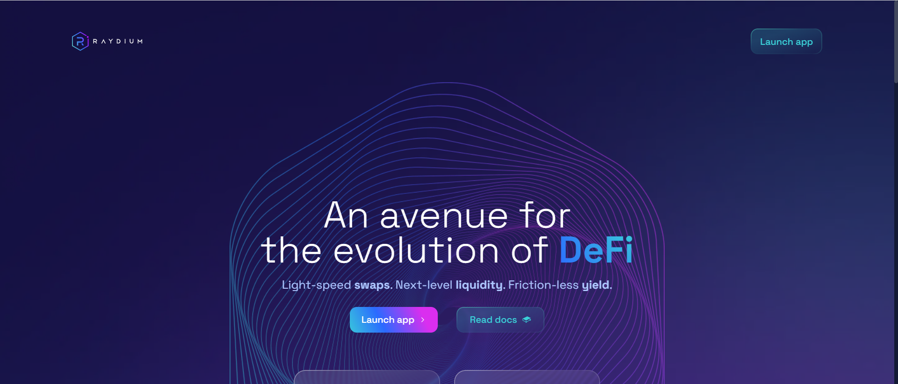

# Raydium

Raydium 是建立在 Solana 区块链上的自动化做市商 (AMM)，它利用 Serum 去中心化交易所 (DEX) 的中央订单簿来实现闪电般的交易、共享流动性和赚取收益的新功能。

👽 Raydium 为何与众不同？

其他 AMM DEX 和 DeFi 协议只能在自己的池中获取流动性，而无法访问中央订单簿。此外，由于大多数平台都在以太坊上运行，因此交易速度很慢，gas 费用也很高。

Raydium 提供了一些关键优势：

- 更快更便宜：我们利用 Solana 区块链的效率来实现比以太坊更快的交易量，而 gas 费用只是成本的一​​小部分。

- 生态系统流动性的中央订单簿：Raydium 为 Serum DEX 的中央限价订单簿提供链上流动性，这意味着 Raydium 允许访问整个 Serum 生态系统的订单流和流动性。

- 交易界面：对于希望能够查看 TradingView 图表、设置限价单并对其交易有更多控制权的交易者。

