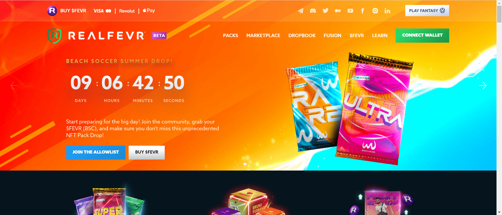

# RealFevr

RealFevr 是一家于 2015 年在幻想市场成立的公司，其足球 P2E 手机游戏目前在 App 和 Play 商店的下载量超过 200 万。随着梦幻联赛的概念现已得到证实，RealFevr 正在通过推出首个由 IP 完全支持的足球视频 NFT 市场，成为 NFT 市场的领导者。NFT 也将被集成到手机游戏中。代币 $FEVR 是 RealFevrs 生态系统的燃料，因为它是 Play2Earn 移动游戏的奖励，也是 NFT 市场的货币。

