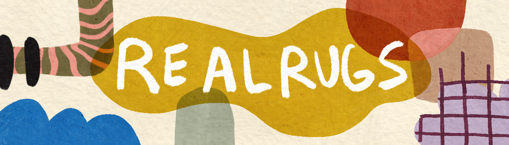

# realrug

Real Rugs 的创建是为了让艺术不仅存在于区块链上，而且还可以转化为有触觉的、真实世界的陈述作品。随着我们技术的飞速发展，我们深入到网络空间，地毯制作等古老的艺术形式开始沉入后台。Real Rugs 是纺织品形式从这个世界上取下 IRL 手铐并加入区块链的一种方式。每件作品都是独一无二的，由拥有近十年纺织经验的纤维艺术家精心设计和手工制作。它们代表了不同的感恩空间，有些碎片是可以识别的，有些只是一种感觉，是某种能量的代表。一种提醒我们周围美丽事物的方式，我们已经忘记了，提醒您在现实世界中浪漫化您的生活。

