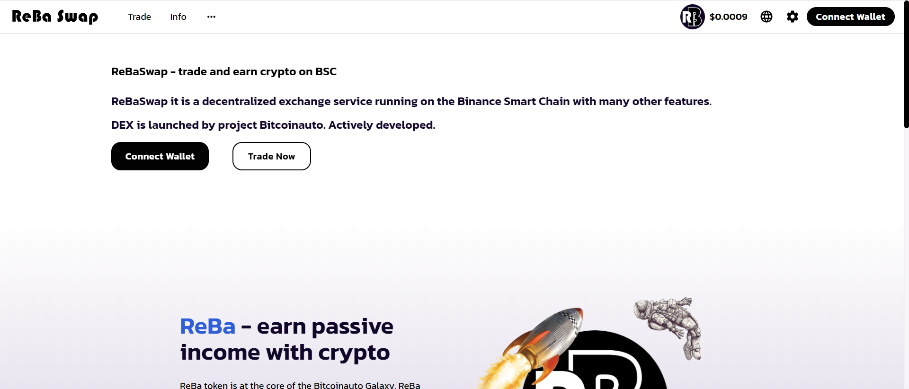

# ReBa Swap

ReBa 代币是 Bitcoinauto Galaxy 的核心。 

ReBa 代币是作为一种服务代币创建的，用于访问加密货币和其他项目提案的赚取服务。 

添加流动性，发送到农场Bitcoinauto并在所有交易中赚取ReBa，BTC，Cake，BUSD + 0.17％的交易费。

ReBaSwap - 在 BSC 上交易和赚取加密货币
ReBaSwap 它是运行在币安智能链上的去中心化交易服务，具有许多其他功能。
DEX 由 Bitcoinauto 项目发起。积极发展。

