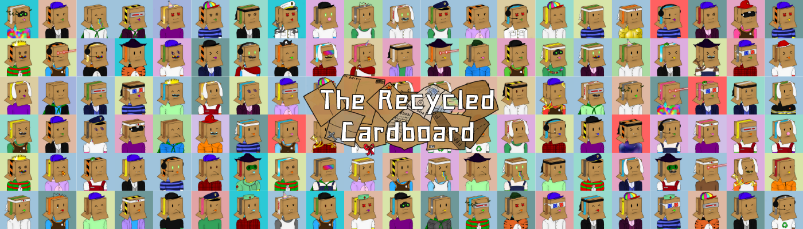

# TheRecycledCardboard

回收纸板开始于一些好心人回收他们的纸板，其中一些碎片掉进了实验室，这就是我们的创造方式。

Recycled Cardboard 是在以太坊兼容的多边形股权证明 (POS) 网络上通过算法生成的 8888 个 NFT 的独特集合，作为 ERC-721 NFT。该系列的每个 NFT 都是独一无二的！

该项目旨在提高人们对回收废物和保护地球力量的认识。这就是为什么 10% 的销售额都捐给了环保慈善机构！每个 Cardbordians 都有资格获得未来的社区赠品、空投、进入实验室和更多惊人的功能。

价格：0 到 4999：0.01 Eth < 当前阶段

