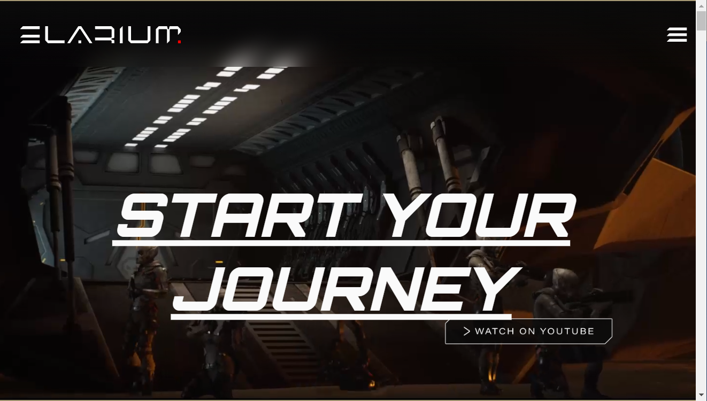

# Reever Insignias

**游戏概述**
在未来的战争环境中为胜利而战！Elarium 是一款具有竞争力的免费团队对团队第一人称射击游戏，将熟悉的快节奏战斗体验与广泛的用户生成内容工具箱相结合，允许创作者制作以 NFT 形式分发的游戏内资产和皮肤。

**会有多少个 NFTS？**
每个系列的总供应量各不相同。Elarium：人类（9066），Elarium：Zoyds（6044），Elarium：Akaris（3022）。我们将首先推出 Human 系列，然后是 Zoyds，最后是 Akaris。Elarium Humans 的收藏家将有机会燃烧 2 个人类 NFT 以换取 1 个免费的 Zoyd 薄荷糖。同样，可以燃烧 2 个 Zoyds NFT 以获得 1 个免费的 Akari 铸币厂。这些“免费”薄荷糖最多只能用于该系列的 50%。例如，只有 3022 个 Zoyds 和只有 1511 个 Akaris 可以免费铸造。其余的将通过荷兰拍卖铸造。此外，可获得的维修套件允许升级 NFT 的衰减状态。

