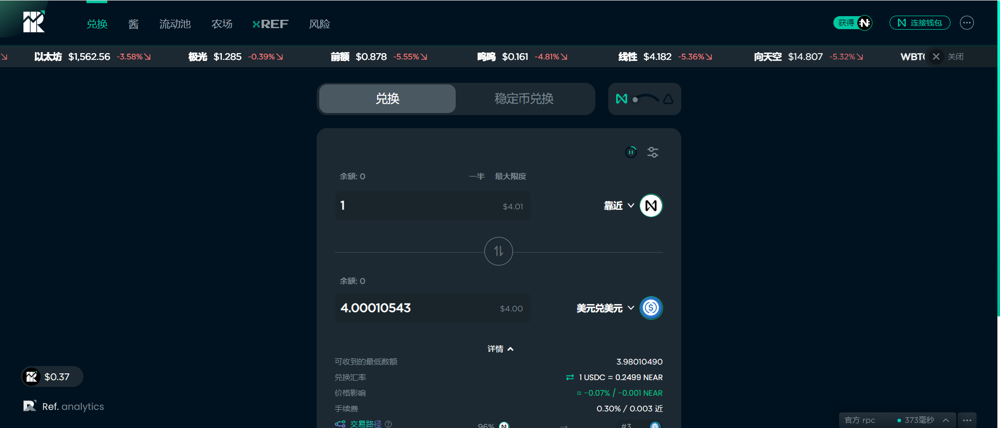

# Ref Finance

Ref 充分利用了 NEAR 的低费用（每次交换 0.005 美元）、一到两秒的确定性和基于 WebAssembly 的运行时（你好，Rust 智能合约！）。

使用最近推出的彩虹桥（NEAR <> ETH），交易者可以利用来自以太坊的数十亿美元的符合 ERC-20 标准的资产，最终来自任何链（BSC、Polygon/Matic、Cosmos/IBC 等）在 NEAR 上。

Ref Finance 的第一个产品是自动做市商 (AMM)。它类似于 Uniswap，但有一些变化： - 单个合约中的多个池。交易者可以在单笔交易中以原子方式跨矿池进行交易——每个矿池可定制的 LP 费用。LP 可以对非流动性或高度波动的代币收取更高的费用。掉期的推荐费，目前设定为 1 个基点。开发人员可以通过在 Ref Finance 之上构建 UI 和其他应用程序来获得奖励

