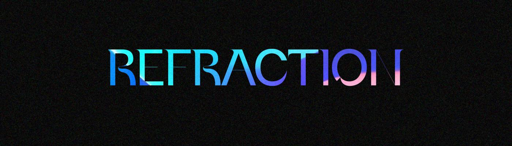

# Refraction Season 0 Founding Artists Collection

Refraction 是一个多元化的社区，他们制作节日和正在进行的活动，发布 NFT 项目，并围绕当今的艺术、文化和音乐创作书面、视觉和音频内容。今年的音乐节将在全球范围内举行，表演、装置和音乐布景将被录制，最终在 Open Metaverse 中成为一个延长的节日。

**第 02 季创意补助金**
对于第 02 + 03 季，Refraction DAO 将通过在全球范围内向社区公开呼吁启动创意资助计划。赠款将在 3 个资助级别中授予，总计高达 10 万美元 USDC，并将在活动和委员会提交之间分配。所有赠款都将根据生产要求授予，这将支持、代表和与 DAO 收集、执行和促进的先前项目一起生活。‍ 创意资助计划使我们能够分散我们
的
该计划由 3 层组成，分配给活动和社区节目，以及折射收集和编辑平台的佣金。

