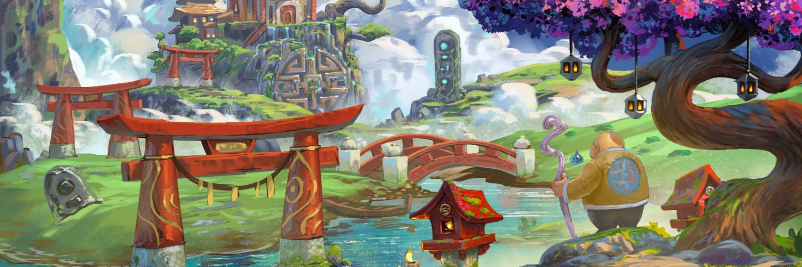

# BuddhaBrothers - Reincarnation Pass

**什么是佛兄弟？**
•  8'888 尊独特的 3D 佛像，包含 200 多种元素，铸币后将转世。他们的目标——达到最高海拔状态。

 •  Buddha Brothers 是第一个“Give-to-Earn”NFT 项目。我们通过利用 Web3 和博弈论工具将利他主义游戏化。 

 • 我们的第一个集合将是动态 NFT (dNFT)。根据你的行为，你的佛像——以及它的价值——将会改变！

**它是如何工作的？**
• 佛只关心两件事：财务和精神繁荣——在我们的生态系统中，这转化为他们的$Belly 代币和他们的业力点数。

•  BELLY$ 是为我们的生态系统提供动力的代币。拥有佛像会生成 Belly$ 代币，也可以通过玩 Give-to-Earn 游戏来赚取。BELLY$ 可用于铸造独家 NFT、解锁游戏内特征等等…… 
•  Karma 是一种积分系统，通过我们的慷慨证明协议奖励游戏中和生活中的慷慨。

