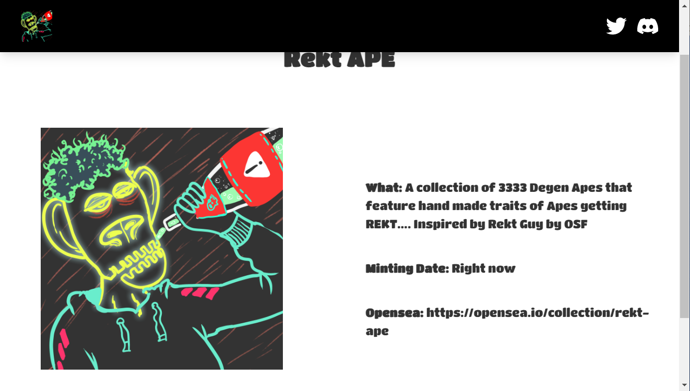

# Rekt Ape

Rekt APE
内容：3333 只 Degen Apes 的集合，具有手工制作的 Apes 获得 REKT 的特征……灵感来自 OSF 的 Rekt Guy

铸造日期：现在

Rekt Ape NFT - 常见问题（FAQ）
▶ 什么是 Rekt Ape？
Rekt Ape 是一个 NFT（非同质代币）集合。存储在区块链上的数字艺术品集合。
▶ 有多少 Rekt Ape 代币？
总共有 3,333 个 Rekt Ape NFT。目前，613 位车主的钱包中至少有一个 Rekt Ape NTF。
▶ 什么是最昂贵的 Rekt Ape 销售？
售出的最昂贵的 Rekt Ape NFT 是 Rekt Ape #2921。它于 2022 年 6 月 20 日（2 个月前）以 0.5 美元的价格出售。
▶ 最近卖出了多少 Rekt Ape？
过去 30 天内售出了 11 个 Rekt Ape NFT。
▶ Rekt Ape 的价格是多少？
在过去 30 天里，最便宜的 Rekt Ape NFT 销售额低于 0 美元，最高销售额超过 0 美元。在过去 30 天内，Rekt Ape NFT 的中位价格为 0 美元。
▶ 什么是流行的 Rekt Ape 替代品？
许多拥有 Rekt Ape NFTs 的用户还拥有 Far Fetched Labs Original、 Pixelated Shit、 DWARFTowns.wtf和 mrboba，这些都是输家。

