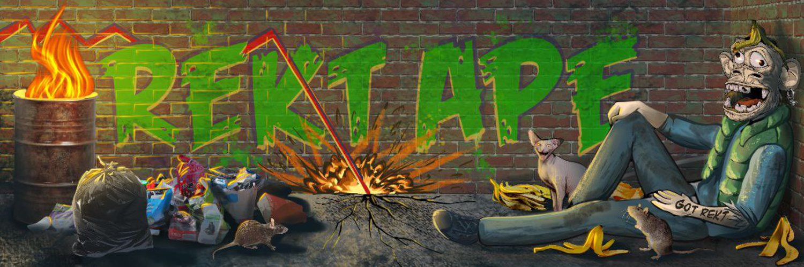

# RektApeCopeClub

Rekt Apes 的 Genesis 集合由 10k 随机生成的手绘猿组成，这是对昂贵 JPEG 的退化模仿和退化文化。虽然受到 BAYC 的启发，但所有特征都是从零开始精心手工绘制的。

每个 Rekt Ape 都可以访问私人 Discord，并兼作 Rekt&Rich 通行证——这是团队在社区直接参与下未来掉落的关键。
Rekt Ape Cope Club 是一个由 degens 组成的私人社区，他们聚在一起享受 NFT 空间的骑行。这是一个安全的空间，您可以在这里分享您如何获得 rekt 的故事，并一起找到一种方法来应对疯狂的 NFT 海洋。
Rekt Apes 是该项目推出的第一个系列，而且绝对不会是最后一个。加入俱乐部以保持关注并获得团队制作的免费薄荷糖，为新的掉落贡献想法。不要追逐阿尔法，创造阿尔法。

