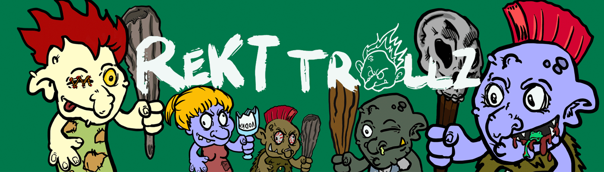

# RektTrollz

**RektTrollz NFT - 常见问题（FAQ）**
▶ 什么是 RektTrollz？
RektTrollz 是一个 NFT（不可替代令牌）集合。存储在区块链上的数字艺术品集合。
▶ 有多少 RektTrollz 代币？
总共有 2,425 个 RektTrollz NFT。目前，1,038 位所有者的钱包中至少有一个 RektTrollz NTF。
▶ 最昂贵的 RektTrollz 销售是什么？
售出的最昂贵的 RektTrollz NFT 是 Rekt Trolls #2875。它于 2022-06-09（3 个月前）以 17.9 美元的价格售出。
▶ 最近卖出了多少 RektTrollz？
过去 30 天内售出了 10 个 RektTrollz NFT。
▶ 什么是流行的 RektTrollz 替代品？
许多拥有 RektTrollz NFT 的用户还拥有 Paradise Trippies MintPass、 One Day Mekabae、 DROIDzWORLD-OFFICIAL和 Drunk Ass Dinos。

