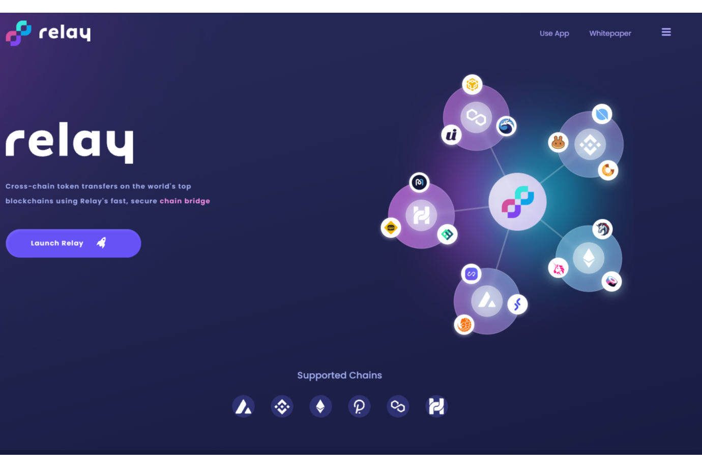

# Relay Chain

Relay 通过将跨链互换集成到流行的 DEX、CEX、dApp 和钱包中，允许交易者同时进入多个市场，带来新的套利机会并增加对有利可图的交易的敞口。对于我们其他人来说，Relay 意味着我们可以在区块链之间简单、安全和快速地移动加密货币，让大众可以访问跨链 DeFi。因为Relay 是一项服务，你甚至可能不知道你在使用它，但 Relay 是 DeFi 的首屈一指的桥梁，统一了去中心化的世界并奖励提供帮助的持有者。

Stake Relay 并直接以原生 gas 代币（ETH、BNB、AVAX、HT、MOVR、MATIC）赚取 Bridge 费用

