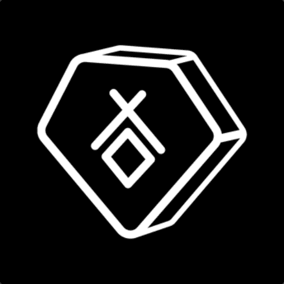

# RELICS Season 1

收集和展示文物。每个 RELIC 都包含来自 Monstercat 电子音乐家名单的独特视觉和完整歌曲。

拥有您最喜欢的艺术家的时刻。

您的遗物将在 Metaverses 中解锁独特的互动。即将与 Jadu、Decentraland 等集成！

您的 RELIC 包括在 Decentraland 等 Metaverses 中播放歌曲的许可。随着项目的发展，未来的元界合作伙伴将被添加。

每个 RELIC 的音乐家和视觉艺术家都从其版本的初级和次级销售中获得报酬。

RELICS 为创意人员提供了额外的收入来源，销售 1 个 RELIC 大致相当于一首歌曲在传统流媒体服务上播放 100 万次所获得的收入。

RELICS 和 Monstercat 努力让地球变得更美好。Monstercat 承诺对售出的每个 RELIC 进行 25 倍的碳封存。我们将把这个数额翻倍，并投资于一个致力于环境的基金。

