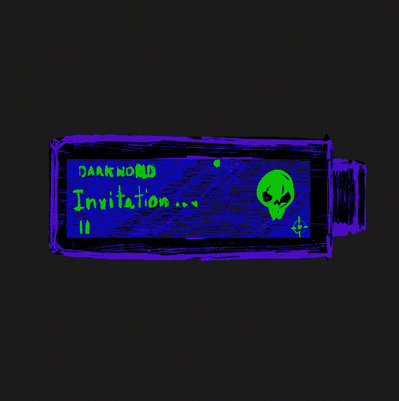

# remikz secret lab

▶ 什么是 remikz 秘密实验室？
remikz 秘密实验室是一个 NFT（不可替代令牌）集合。存储在区块链上的数字艺术品集合。
▶ 存在多少 remikz 秘密实验室代币？
总共有 6 个 remikz 秘密实验室 NFT。目前，27 位所有者的钱包中至少有一个 remikz 秘密实验室 NTF。
▶ 最昂贵的 remikz 秘密实验室销售是什么？
最昂贵的 remikz 秘密实验室 NFT 是 Dark ticket。它于 2022 年 7 月 4 日（2 个月前）以 230.5 美元的价格售出。
▶ 最近卖了多少remikz秘密实验室？
过去 30 天内售出了 15 个 remikz 秘密实验室 NFT。
▶ remikz 秘密实验室的费用是多少？
过去 30 天，最便宜的 remikz secret lab NFT 销售额低于 176 美元，最高销售额超过 231 美元。过去 30 天，remikz 秘密实验室 NFT 的中位数价格为 220 美元。
▶ 什么是流行的 remikz 秘密实验室替代品？
许多拥有 remikz 秘密实验室 NFT 的用户还拥有 Dream_Savers_Mirror、 Iconoclasm editions、 Believe in Steve EDITIONS和 Gunnar Magnus 的 Heavenly Bodies。

