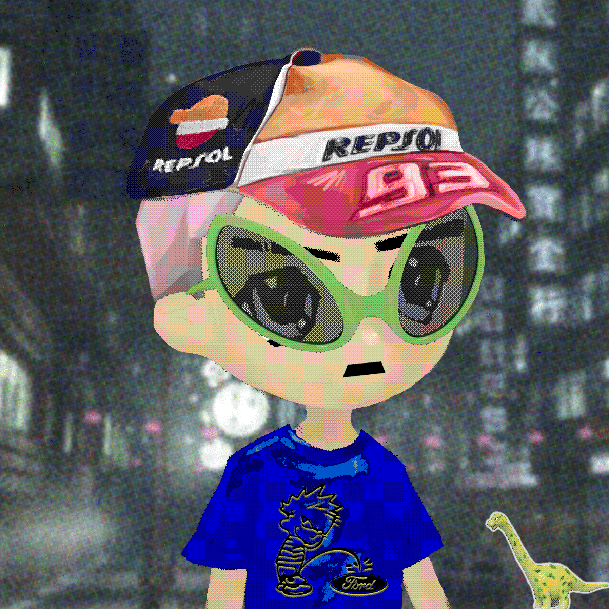

# Redacted Remilio Babies

Remilio Maker 是男孩的 Milady。 以Ulenka

的 艺术为 特色， “Remilionaire”的领导， Yayo Corporation 的咨询 ，以及Charlotte Fang的实习生的指导。 Redacted Remilio Babies 是 10,000 个新奇比 pfpNFT 的集合，通过引入年轻的

JIT能量、精神分裂症的反动美学和数字销售恐怖主义。我们是#REMILIONAIREs。 Remilio 继承了Milady Sonora

定义的标志性 Milady 风格 ，是经典 10,000 供应 pfpNFT 标准的全新实现。该设计扩展了 Milady Sonora Sprite 的“OG Milady”的最早衍生产品之一，来自于 Milady Maker NFT 之前的 Remilia Collective 成员Fod Korp（以3DTestosterone.net闻名）。

Remilios 以一股青春活力的浪潮席卷了时间线，将这些灵感引导到相同的定向混乱中，使 Milady 与 NFT 和加密推特作为一个社区的单调区别开来，同样清晰的metairy 一直是 Remilia 革命的精髓张贴作为艺术实践。

